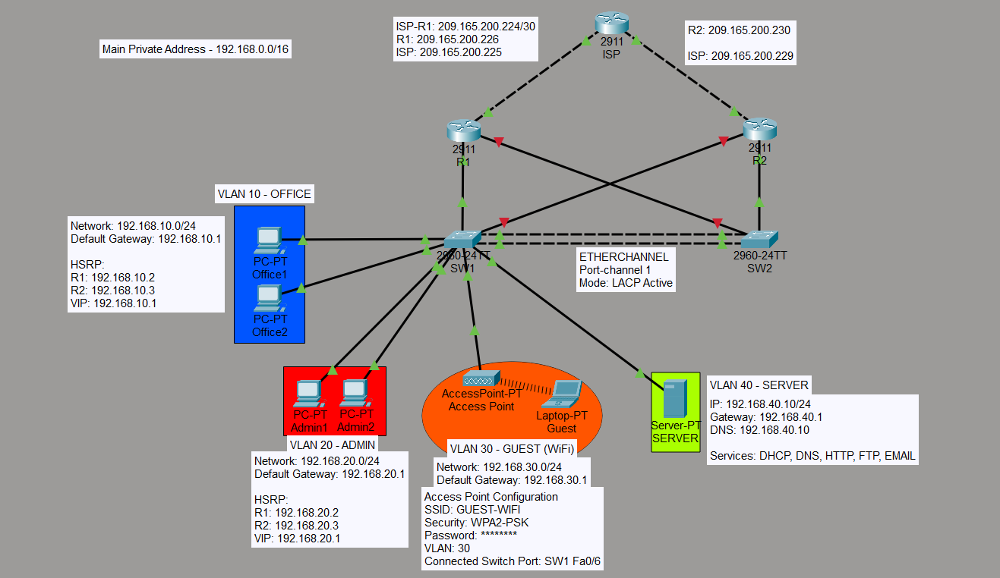

# Enterprise Network Lab - Cisco Packet Tracer



## Project Overview

This project represents a simulated enterprise office network designed and configured in Cisco Packet Tracer.

The goal of this project was to build a secure, scalable and redundant network environment using Cisco networking technologies commonly used in enterprise environments.

## Network Technologies Implemented

- VLAN segmentation
- Router-on-a-Stick inter-VLAN routing
- HSRP gateway redundancy
- EtherChannel (LACP)
- Spanning Tree Protocol (PVST)
- Port Security
- DHCP Relay
- NAT/PAT Overload
- Access Control Lists (ACL)
- WAN Firewall Rules
- Guest Wireless Network

---

# Network Design

## VLAN Configuration

| VLAN | Name | Purpose |
|------|------|---------|
| 10 | OFFICE | Employee devices |
| 20 | ADMIN | Administration devices |
| 30 | GUEST | Guest wireless network |
| 40 | SERVER | Internal server network |

---

# High Availability

HSRP was configured between two routers to provide gateway redundancy.

## HSRP Configuration

| VLAN | Virtual Gateway | Active Router | Standby Router |
|------|----------------|---------------|----------------|
| 10 | 192.168.10.1 | R1 | R2 |
| 20 | 192.168.20.1 | R1 | R2 |
| 30 | 192.168.30.1 | R1 | R2 |
| 40 | 192.168.40.1 | R1 | R2 |

R1 operates as the primary gateway with higher HSRP priority, while R2 provides redundancy.

---

# Switching Configuration

## EtherChannel

Link aggregation was implemented using LACP:

- SW1 ↔ SW2
- Port-channel 1
- IEEE 802.3ad LACP

Benefits:

- Increased bandwidth
- Link redundancy
- Improved availability

---

## Spanning Tree Protocol

PVST was configured to prevent Layer 2 loops.

SW1 was configured as the Root Bridge for VLANs:

- VLAN 10
- VLAN 20
- VLAN 30
- VLAN 40

---

# Security Implementation

## Port Security

Port security was enabled on user-facing switch ports.

Configuration:

- Sticky MAC addresses
- Maximum one MAC address per port
- Violation actions configured depending on port importance

---

## ACL Security Policies

Traffic filtering was implemented between VLANs.

Examples:

- Guest VLAN cannot access internal VLANs
- Office VLAN has restricted access to Admin VLAN
- Server VLAN access is controlled using ACL rules

---

## WAN Firewall

Inbound WAN traffic is filtered using extended ACL rules.

Implemented protections:

- Allow established TCP sessions
- Block unsolicited inbound traffic to internal networks
- Allow required Internet communication

---

# NAT/PAT Configuration

Network Address Translation with Port Address Translation was configured to provide Internet access for internal users.

Inside networks:

- 192.168.10.0/24
- 192.168.20.0/24
- 192.168.30.0/24
- 192.168.40.0/24

Translated using:

- NAT Overload (PAT)
- Public interface: GigabitEthernet0/1

---

# Wireless Guest Network

A separate Guest VLAN was configured for wireless users.

Implemented:

- Dedicated Guest SSID
- Guest VLAN separation
- Restricted access to internal resources
- Internet-only access policy

---

# Server Network

Server devices are placed in a dedicated Server VLAN:

- VLAN 40
- Network: 192.168.40.0/24

DHCP Relay was configured on router subinterfaces to forward DHCP requests to the server network.

---

# Verification

The following commands were used to verify the configuration:

```
show vlan brief
show interfaces trunk
show etherchannel summary
show spanning-tree vlan 10
show standby
show ip route
show ip nat translations
show access-lists
show port-security
```

Full CLI outputs are available in:

`CLI.txt`

---

# Project Files

```
Enterprise-Network-Lab-Cisco
│
├── README.md
├── Topology.png
├── CLI.txt
└── RedundancyNetwork.pkt
```

---

# Author

Vuk Bojković

Cisco Networking Lab Project
